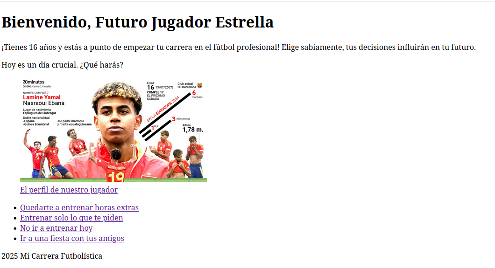

# Historia Interactiva - El Futbolista

## Descripción

Este proyecto es una historia interactiva en la que el jugador toma el papel de un joven de 16 años que debe tomar decisiones clave en su camino para convertirse en un futbolista exitoso o fracasar en el intento. La historia se desarrolla exclusivamente con HTML, sin el uso de JavaScript ni CSS, cumpliendo con las restricciones del ejercicio.

## Imagen de la pantalla principal

